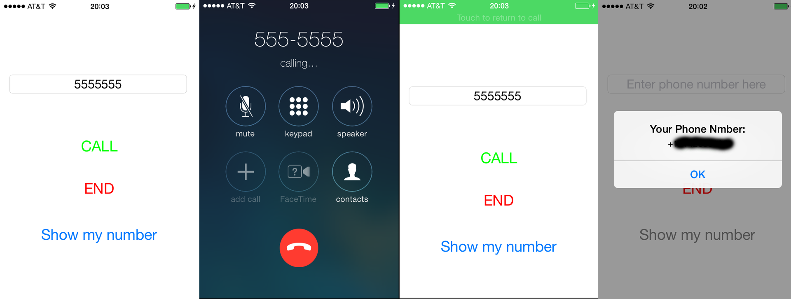

JBCall - sample app for calls on JB iOS7
=======

###  [For Jailbroken devices only!]

This is test iOS application which allows you to make calls.



[Question on stackoverflow][32866c8e]

  [32866c8e]: http://stackoverflow.com/questions/19504478/ios-7-how-to-get-own-number-via-private-api "Question on stackoverflow"

[Article on Russian it resource habrahabr.ru][ebc3b318]

  [ebc3b318]: http://habrahabr.ru/post/233295/ "Article on russian it resource habrahabr.ru"

# How to use?

* Sync repository
* Build without code signature
* Find path where Xcode placed binaries:
```
$ls -la ~/Library/Developer/Xcode/DerivedData/ | grep JBCall
```
* Correct following vars in install script [**install_app.sh**]:
    * PASSWD='**mypass**'
    * IP='**10.231.65.56**'
    * PROFILE_NAME='iPhone Developer: FirstName  SecondName (XXXXXXXXXX)'
    * APP_ON_MAC="/Users/**username**/Library/Developer/Xcode/DerivedData/**JBCall-cktasembftvbmqaaiiunvljdwocs**/Build/Products/Debug-iphoneos/JBCall.app"
```
#To find name of folder with binaries:
$ls -la ~/Library/Developer/Xcode/DerivedData/ | grep JBCall
```
  To find profile name check your keychain records
* Make scripts runnable:
```
$chmod +x ./install_app.sh
$chmod +x ./remove_app.sh
```
* Install app:
```
$./install_app.sh
```

#### To use scripts you need **sshpass** tool installed.
To install it use command:
```
$sudo apt-get install sshpass
```
